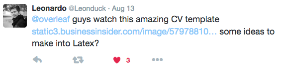
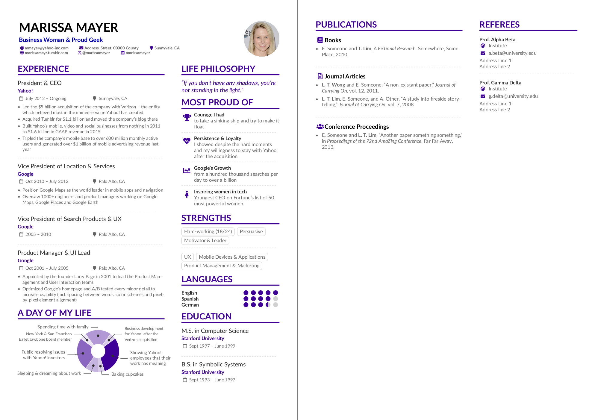
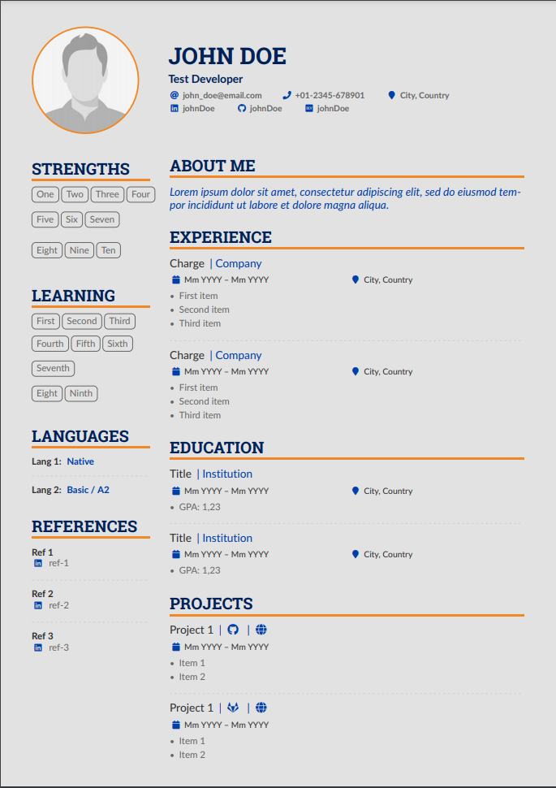

# AltaCV, yet another LaTeX CV/Résumé class

v1.1.3 (30 April 2017), by LianTze Lim (liantze@gmail.com)

(Thanks to [Nur](https://github.com/nurh) for the name.)

It all started with this:

[]
(https://twitter.com/Leonduck/status/764281546408923136)

Leonardo was talking about a [résumé of Marissa Mayer that Business Insider put together](http://www.businessinsider.my/a-sample-resume-for-marissa-mayer-2016-7/) using [enhancv.com](https://enhancv.com).
I _knew_ I had to do something about it. And so AltaCV was born.

## Samples

This is how the re-created résumé looks like ([view/open on Overleaf](https://www.overleaf.com/latex/examples/recreating-business-insiders-cv-of-marissa-mayer-using-altacv/gtqfpbwncfvp)):

Though if you're creating your own CV/résumé, you'd probably prefer using the basic template ([view/open on Overleaf](https://www.overleaf.com/latex/templates/altacv-template/trgqjpwnmtgv)):

## Requirements and Compilation

* pdflatex + biber + pdflatex
* AltaCV uses [`fontawesome`](http://www.ctan.org/pkg/fontawesome) and [`academicons`](http://www.ctan.org/pkg/academicons); they're included in both TeX Live 2016 and MikTeX 2.9.
* Loading `academicons` is optional: enable it by adding the `academicons` option to `\documentclass`.
* Can now be compiled with pdflatex, XeLaTeX and LuaLaTeX!
* However if you're using `academicons`, you _must_ use either XeLaTeX or LuaLaTeX. If the doc then compiles but the icons don't show up in the output PDF, try compiling with LuaLaTeX instead.
* The samples here use the [Lato](http://www.latofonts.com/lato-free-fonts/) font.
