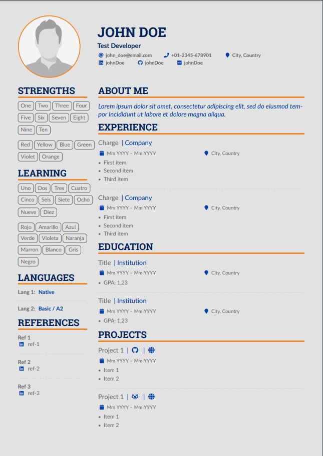

# AltaCV, yet another LaTeX CV/Résumé class | A fork

v1.6.5 (3 Nov 2022), by LianTze Lim (liantze@gmail.com)

v1.6.5a (29 Jan 2023), by Nicolás Omar González Passerino (nicolas.passerino@gmail.com)

## Original Sample

* Added \mynames{...} to specify names to be highlighted in the publication list on 3 Nov 2022
* Starred `\NewInfoField*` command to handle Mastodon; Icons, `\cvskills`, `\wheelchart` have "copyable" text values; `\cvskill` supports numerical values {0.5, 1, ..., 4.5, 5} on 21 May 2021
* Moved `biblatex`-related code to `*.cfg` files for easier edit on 8 May 2021
* Removed dependency on `academicons` on 12 Apr 2021
* Clickable hyperlinked info fields added on 10 May 2020
* Sample file with new `paracol` layout added on 2 February 2020

## Forked Sample

Before v1.6.5a:
* **Added:** Contact options added for dev.to, medium and npm accounts.
* **Added:** Adapted color scheme as well as `darkmode` (enable in line 31 of file `main.tex`).
* **Added:** (`\cvlang`) tag added for languages rating, avoiding star/button/progress bar previous ideas, I made a simpler and more accurate representation using a single string, which will be colored to be oustanding.
* **Updated:** (`\@makeaphoto`) Photo image has modified to include a border around it, which color is aligned to document's theme.
* **Updated:** (`\altacv@add@photo@left`) Horizontal space changed from 1ex to 6,5ex to align photo container width to smaller column width (25%).
* **Updated:** (`\cvsection`) separation has been changed by adding 2 `\bigskip`.
* **Updated:** (`\cvevent`) structure modified to include change title, company name, start/end dates and work location (only a string).
* **Updated:** (`\cvtag`) items now have a more consistent vertican and horizontal separation.

Though if you're creating your own CV/résumé, you'd probably prefer using the online template ([view/open on Overleaf](https://www.overleaf.com/latex/templates/altacv-nicolasomar-fork/htfpmrwhbwpw)):

This is how the final version looks like on:

### Light mode


### Dark mode


## Requirements and Compilation

* pdflatex + biber + pdflatex
* AltaCV uses [`fontawesome5`](http://www.ctan.org/pkg/fontawesome5).
* Use the `normalphoto` option to get normal (i.e. non-circular) photos.
* As of v1.2 you can add multiple photos on the left or right: `\photoL{2cm}{logo1}` and `\photoR{2.5cm}{logo2,photo}`. (`\photo` will work like `\photoR`.) Separate your image filenames with commas _without_ spaces.
* Use the `ragged2e` option to activate hyphenations while keeping text left-justified; line endings will thus be less jagged and more aesthetically pleasing.
* As of v1.3 the `withhyper` document class option will make the "personal info" fields into clickable hyperlinks (where it makes sense). See below for more details.
* Can now be compiled with pdflatex, XeLaTeX and LuaLaTeX!
  * Note that to compile with XeLaTeX, you should use a command line as follows, per [the `pdfx` documentation](http://mirrors.ctan.org/macros/latex/contrib/pdfx/pdfx.pdf): `xelatex -shell-escape -output-driver="xdvipdfmx -z 0" sample.tex`
* The samples here use the [Lato](http://www.latofonts.com/lato-free-fonts/) and [Roboto Slab fonts](https://github.com/googlefonts/robotoslab). Feel free to use a different typeface package instead—often a different typeface will change the entire CV's feel.

## `sample.tex` [WAS `sample-alt.tex` 2 FEBRUARY 2020, DEFAULT SINCE 10 MAY 2020] ##
Many users have overlooked the optional argument of `\cvsection` to insert the right sidebar contents, and often confused that the right sidebar doesn't automatically break across pages. This new layout uses the `paracol` package for typesetting the left and right columns that _can_ break across pages. It also makes changing the column widths easier:

```latex
%% Set the left/right column width ratio to 6:4.
\columnratio{0.6}

% Start a 2-column paracol. Both the left and right columns will automatically
% break across pages if things get too long.
\begin{paracol}{2}
\cvsection{Experience}
...
... END OF LEFT COLUMN CONTENTS ...

% Now switch to the right column.
\switchcolumn
\cvsection{Education}
...
...END OF RIGHT COLUMN CONTENTS ...
\end{paracol}
```
You can also use `\swithcolumn*` for "synchronising" the columns, as well as other commands from the `paracol` package. See the [`paracol` package documentation](http://texdoc.net/pkg/paracol) for further details.

**You do not need use the `fullwidth` environment nor use optional arguments with `\cvsection` with this new template.**

## Clickable Info fields

As of v1.3, the `withhyper` document class option will load the `hyperref` package, and make fields in the personal detail fields into clickable hyperlinks (where it makes sense anyway).

*BIG CAVEAT:* Remember that not all readers may want to click on hyperlinks in PDFs. You may therefore sometimes want to _remove_ `withhyper`, and spell out the field URL details a bit more completely, e.g. `\github{github.com/your-id}`.

Anyway assuming that you _do_ keep `withhyper` enabled: For each field e.g. `\homepage{foobar.com}`, a `\homepagesymbol` has been defined, and the clickable hyperlink is generated by prepending the `\homepagehyperprefix` to `foobar.com`. The `\homepgehyperprefix` is defined to be `\https://`, so this generates the hyperlink `https://foobar.com`.

If your homepage doesn't use HTTPS yet, or if you want to use a different symbol, you can re-define them with
```latex
\renewcommand{\homepagehyperprefix}{http://}
\renewcommand{\homepagesymbol}{\faLink}
```


## New Information Fields ####

I've decided against adding definitions for too many fields and symbols in the `.cls` itself; otherwise we'll have all possible platforms in the world (and more services are born everyday!) within `altacv.cls` before we know it.

You can actually just typeset your own arbitrary information fields using the `\printinfo{symbol}{detail}[optional hyperlink prefix]` command within `\personalinfo`:

````latex
\printinfo{\faPaw}{Hey ho!}
\printinfo{\faGitLab}{your-handle}[https://gitlab.com/]
````

Or if you really prefer, you can define a new field yourself with `\NewInfoFiled{fieldname}{symbol}[optional hyperlink prefix]` before  using it:

````latex
\NewInfoField{gitlab}{\faGitlab}[https://gitlab.com/]
\gitlab{your_id}
````

For services and platforms like Mastodon where there isn't a straightforward relation between the more popular user ID or nickname and the hyperlink, you can use `\printinfo` directly e.g.

```latex
\printinfo{\faMastodon}{@username@instace}[https://instance.url/@username]
```

But if you absolutely want to create new dedicated info fields for such platforms, then use `\NewInfoField*` with a star:

```latex
\NewInfoField*{mastodon}{\faMastodon}
```

then you can use `\mastodon` with TWO arguments where the 2nd argument is the full hyperlink.

```latex
\mastodon{@username@instance}{https://instance.url/@username}
```


## Configurable colours

Use `\colorlet` or `\definecolor` to change these.
* `accent`
* `emphasis`
* `heading`
* `headingrule`
* `subheading`
* `body`
* `name`
* `tagline`

## Configurable fonts

Use `\renewcommand` to change these.
* `\namefont`
* `\taglinefont`
* `\personalinfofont`
* `\cvsectionfont`
* `\cvsubsectionfont`

---

## `legacy/sample-old.tex`

This is the original sample template file until 5 May 2020. The right sidebar is actually a _`marginpar`_, so it doesn't support footnote and cannot automatically break across pages if it's too long. You would need to split your right sidebar contents into separate files e.g. `p1sidebar.tex` and `p2sidebar.tex`, and insert them as the optional argument of the `\cvsection{...}` that you want to align them with:

```latex
\cvsection[p1sidebar]{Experience}
...
... END OF FIRST PAGE OF YOUR CV ...
\cvsection[page2sidebar]{Publications}
...
```

This assumes that the next page's main column would start immediately with a `\cvsection`, so that the top of your right sidebar contents also appear at the top of the page. Now if the _next_ page doesn't start with a `\cvsection` but you'd still like to add a sidebar, then use this command on the _current_ page to add it. The optional argument lets you pull up the sidebar a bit so that it looks aligned with the top of the main column:

```latex
\addnextpagesidebar[-1ex]{page3sidebar}
```

If you want to change the left and right columns' widths, you'll need to tinker with the `right` (distance from paper's right edge until the main column's right edge) and `marginparwidth` (width of the right sidebar) options in the `\geometry` line. For example, to make the right sidebar wider by 2cm, you could use

```latex
%% original was right=9cm, marginparwidth=6.8cm
\geometry{left=1cm,right=11cm,marginparwidth=8.8cm,marginparsep=1.2cm,top=1cm,bottom=1cm}
```
as well as doing a bit of arithmetic when you're making the header to get it full-width, i.e. reducing the sidebar by 2cm and extending the main column by 2cm.

```latex
\begin{adjustwidth}{}{-10cm}  %% original was -8cm
\makecvheader
\end{adjustwidth}
```
